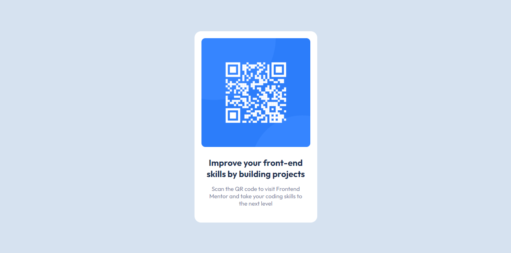

# Frontend Mentor - QR code component solution

Essa é a minha solução para o desafio [QR code component challenge on Frontend Mentor](https://www.frontendmentor.io/challenges/qr-code-component-iux_sIO_H). 

## índice

- [Geral](#geral)
  - [Screenshot](#screenshot)
  - [Feito usando](#tecnologias)
- [Autor](#autor)

## Geral

### Screenshot

### Tecnologias

- HTML5
- CSS
- Flexbox

## Autor

- Frontend Mentor - [@alexyzr](https://www.frontendmentor.io/profile/alexyzr)
- GitHub - [@alexyzr](https://github.com/alexyzr)
